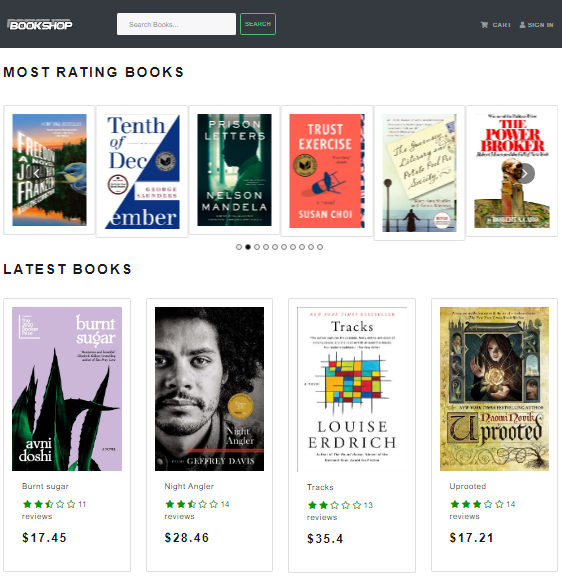

[](https://github.com/ellerbrock/open-source-badges/)

# E-commerce web-app built with MERN stack
 
An example of a complex application (bookstore) with React, Redux, Express and MongoDB



## Getting Started
These instructions will provide you with a copy of the project that will be launched on your local computer for development and testing.

## Prerequisites
What things you need to install the software.

- Git
- NPM
- local MongoDB database
- Robo 3T (or another MongoDB management tool)
- IDE (or code editor)


## Install
Clone the git repository on your computer
```
$ git clone https://github.com/alavir-ua/mern-bookshop.git
```
You can also download the entire repository as a zip file and unpack in on your computer if you do not have git

After cloning the application, you need to install it's dependencies.
```
$ npm install && npm install --prefix frontend 
```

## Set environment keys
When you are done with the installation, rename the .env.example files in your project's root directory and the "frontend" directory to .env and fill them with your local development environment variables.

## Seed Database

You can use the following commands to populate the database with some sample users, categories, books, orders and
 destroy all data.

```
# Import data
npm run data:import

# Destroy data
npm run data:destroy
```

```
Sample User Logins

admin@example.com (Admin)
123456

19 random users
password 123456
```

## Run the application
```
# Run frontend (:3000) & backend (:8080)
npm run dev

# Run backend only
npm run server

# Run frontend only
npm run client
```

After that, open the browser at http://localhost:3000/ to view the result.

## Links
[Live Demo](https://mern-bookshop.vercel.app/)
